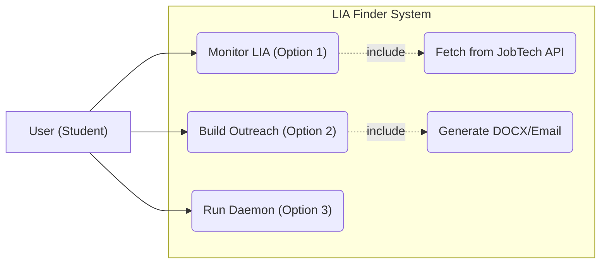
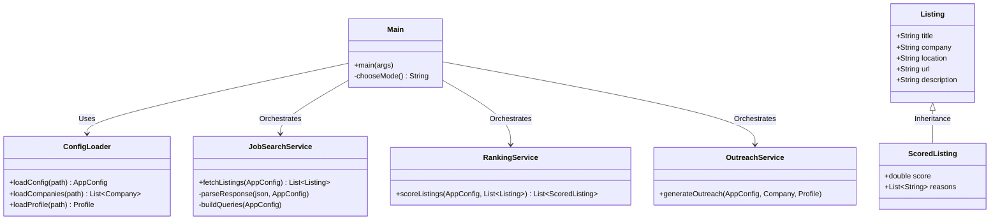

# LIA Finder AI Assistant (Java Version) 🤖🇸🇪

Welcome to the Java port of the **LIA Finder AI Assistant**. This tool is designed to help Java developer students proactively find LIA (Lärande i Arbete) opportunities in Sweden.

The tool monitors the **JobTech (Platsbanken) API**, applies strict relevance filtering, and helps you build outreach materials.

## 📊 Architecture & Use Cases
We follow a modern **Service/DTO architecture**.

### Use Case Diagram


### Class Diagram


Detailed design patterns and descriptions can be found in [**Architecture Diagrams**](architecture_diagrams.md)

## 🚀 How to Run

### 1. Prerequisites
- **Java 17** or higher
- **Maven**
- A **JobTech API Key** (Set as environment variable `JOBTECH_API_KEY`)

### 2. Build the Project
```bash
mvn clean package
```

### 3. Run the Application
You can run the interactive menu by executing the JAR or using Maven:
```bash
java -jar target/lia-finder-1.0-SNAPSHOT.jar
```
Or via Maven:
```bash
mvn exec:java -Dexec.mainClass="com.liafinder.Main"
```

## 🛠️ Configuration
Before running, ensure you have the following files in the project root:
- `config.yaml`: Search terms and strictness rules.
- `companies.yaml`: Your target company list.
- `profile.yaml`: Your personal data for outreach (git-ignored).

## 📖 Walkthrough
For a detailed guide on how the project was built and how to use it, see:
👉 [**Project Walkthrough**](walkthrough.md)

---
*Created with ❤️ for Java students.*
