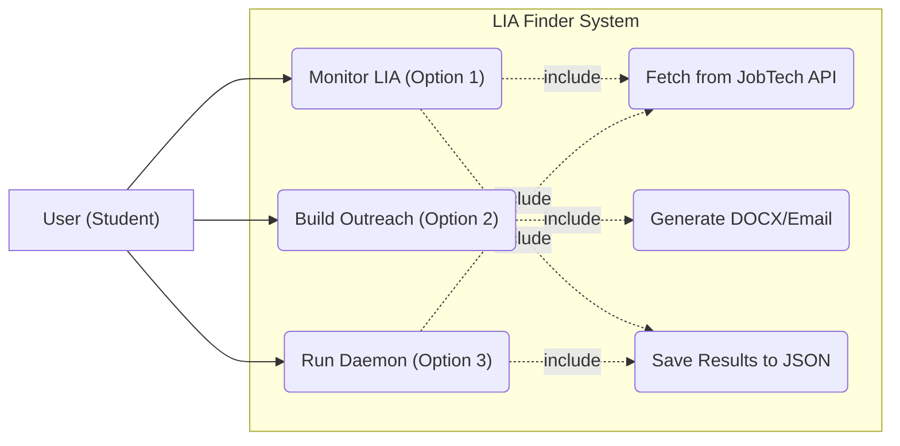
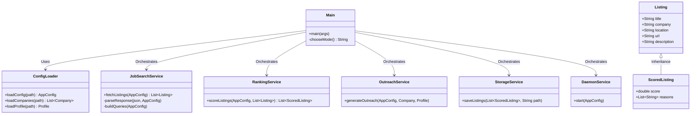

# LIA Finder AI Assistant (Java Version) 🤖🇸🇪

Welcome to the Java port of the **LIA Finder AI Assistant**. This tool is designed to help Java developer students proactively find LIA (Lärande i Arbete) opportunities in Sweden.

The tool monitors the **JobTech (Platsbanken) API**, applies strict relevance filtering, and helps you build outreach materials.

## 📊 Architecture & Use Cases
We follow a modern **Service/DTO architecture**.

### Use Case Diagram

```mermaid
graph LR
    U["User (Student)"]
    
    subgraph "LIA Finder System"
        UC1("Monitor LIA (Option 1)")
        UC2("Build Outreach (Option 2)")
        UC3("Run Daemon (Option 3)")
        UC4("Fetch from JobTech API")
        UC5("Generate DOCX/Email")
        UC6("Save Results to JSON")
    end

    U --> UC1
    U --> UC2
    U --> UC3
    
    UC1 -.->|include| UC4
    UC1 -.->|include| UC6
    UC2 -.->|include| UC5
    UC3 -.->|include| UC4
    UC3 -.->|include| UC6
```

### Class Diagram

```mermaid
classDiagram
    class Main {
        +main(args)
        -chooseMode() String
    }

    class ConfigLoader {
        +loadConfig(path) AppConfig
        +loadCompanies(path) List~Company~
        +loadProfile(path) Profile
    }

    class JobSearchService {
        +fetchListings(AppConfig) List~Listing~
        -parseResponse(json, AppConfig)
        -buildQueries(AppConfig)
    }

    class RankingService {
        +scoreListings(AppConfig, List~Listing~) List~ScoredListing~
    }

    class OutreachService {
        +generateOutreach(AppConfig, Company, Profile)
    }

    class StorageService {
        +saveListings(List~ScoredListing~, String path)
    }

    class DaemonService {
        +start(AppConfig)
    }

    %% Data Models
    class Listing {
        +String title
        +String company
        +String location
        +String url
        +String description
    }

    class ScoredListing {
        +double score
        +List~String~ reasons
    }

    %% Relationships
    Listing <|-- ScoredListing : Inheritance
    Main --> ConfigLoader : Uses
    Main --> JobSearchService : Orchestrates
    Main --> RankingService : Orchestrates
    Main --> OutreachService : Orchestrates
    Main --> StorageService : Orchestrates
    Main --> DaemonService : Orchestrates
```

## 🏗️ Design Patterns
Here is a breakdown of the "building blocks" used in this project and why they make life easier for a developer.

### Service Layer Pattern (The "Specialist" Approach)
**What is it?** A way to organize code by separating the "business logic" (the actual work) from the rest of the app. Instead of putting everything in `Main.java`, we create dedicated classes that act as specialists for specific tasks.
- **In this project:** `JobSearchService` is the "Search Specialist", `RankingService` is the "Judge", and `OutreachService` is the "Writer".
- **Why I used it:** It keeps the code clean. If I need to fix how the search works, I don't risk breaking the email generator.

### DTO / Record Pattern (The "Secure Box")
**What is it?** Simple objects designed solely to carry data between different parts of the system. They don't have complex logic; they just hold information securely.
- **In this project:** `Listing` and `Company` are Java Records.
- **Why I used it:** Records are immutable (read-only). This means once I fetch a job listing, I can be sure no other part of the code accidentally changes the company name or URL. It's a safety net.

### Factory Pattern (The "Complex Assembler")
**What is it?** A method or class responsible for creating objects that are complicated to build. It hides the messy construction details from the rest of the application.
- **In this project:** `ConfigLoader.loadConfig()`.
- **Why I used it:** Reading a YAML file involves opening streams, parsing text, and mapping fields. I hid all that complexity inside `ConfigLoader`. The rest of the app just asks for "the config" and gets it.

### Builder Pattern (The "Step-by-Step" Builder)
**What is it?** A pattern used to construct complex objects step-by-step. It allows you to set only the properties you need, in any order, making the code much more readable than a giant constructor with many arguments.
- **In this project:** Used when creating HTTP requests (`HttpRequest.newBuilder()`).
- **Why I used it:** It makes the code read like a sentence: *"Create a request, set the URI, add a header, make it a GET, and build it."* Much easier to read than `new HttpRequest(url, "GET", headers, null, null...)`.

### Daemon Pattern (The "Background Worker")
**What is it?** A design where a process runs continuously in the background, waiting for a specific time or event to trigger its work, without blocking the main user interface.
- **In this project:** `DaemonService`.
- **Why I used it:** I wanted the app to keep working even when I'm sleeping. This service wakes up every 24 hours, does the search, saves the results, and goes back to sleep, without me needing to click anything.

## 🚀 How to Run

### 1. Prerequisites
- **Java 17** or higher
- **Maven**
- A **JobTech API Key** (Set as environment variable `JOBTECH_API_KEY`)

### 2. Build the Project
```bash
mvn clean package
```

### 3. Run the Application
You can run the interactive menu by executing the JAR or using Maven:
```bash
java -jar target/lia-finder-1.0-SNAPSHOT.jar
```
Or via Maven:
```bash
mvn exec:java -Dexec.mainClass="com.liafinder.Main"
```

## 🛠️ Configuration
Before running, ensure you have the following files in the project root:
- `config.yaml`: Search terms, LIA dates, and strictness rules.
- `companies.yaml`: Your target company list.
- `profile.yaml`: Your personal data for outreach (git-ignored).

## ✨ Features
- **Smart Search**: Queries JobTech API using multiple permutations of "LIA", "Java", and "Stockholm".
- **LinkedIn Integration**: Includes specific LinkedIn-style queries and exclusion patterns.
- **Relevance Scoring**: Ranks ads based on title keywords, description context, and specific dates (e.g., Oct 2026).
- **Persistence**: Saves scored results to `data/listings_TIMESTAMP.json`.
- **Daemon Mode**: Runs continuously in the background (every 24h) to catch new ads.
- **Outreach Builder**: Generates personalized emails and Word documents for applications.

---
*Created with ❤️ for Java students.*

*Stoil* 
