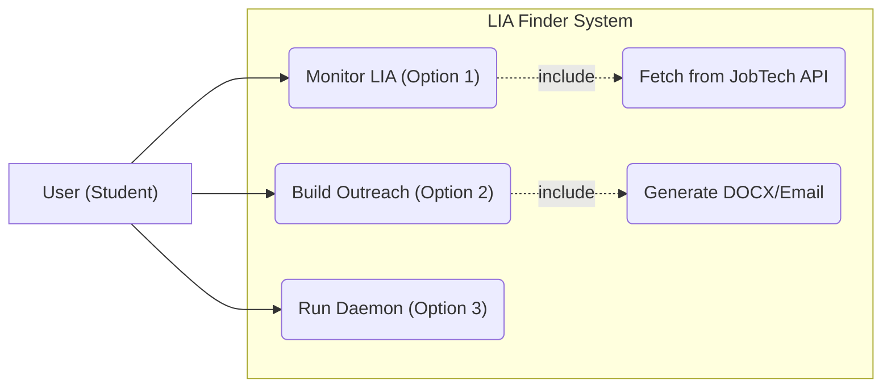
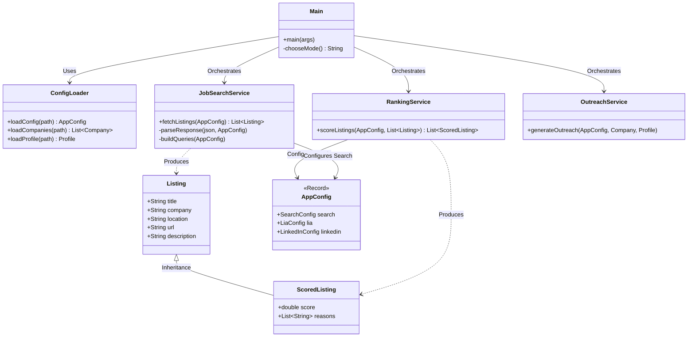

# LIA Finder Java: Architecture Diagrams

This document visualizes the structure and functional flow of the **LIA Finder AI Assistant**.

## 1. Use Case Diagram
This diagram shows how you (the User) interact with the different modes of the application.

---

## 2. Class Diagram
This diagram shows the relationship between data models (Records) and the Business Logic (Services).

## 3. Design Pattern Summary
- **Service Layer Pattern**: Logic is separated into stateless service classes.
- **Data Transfer Object (DTO)**: Java Records are used to move data safely.
- **Static Factory**: `ConfigLoader` acts as a factory for configuration objects.
- **Inheritance**: `ScoredListing` extends `Listing` to add ranking data.
