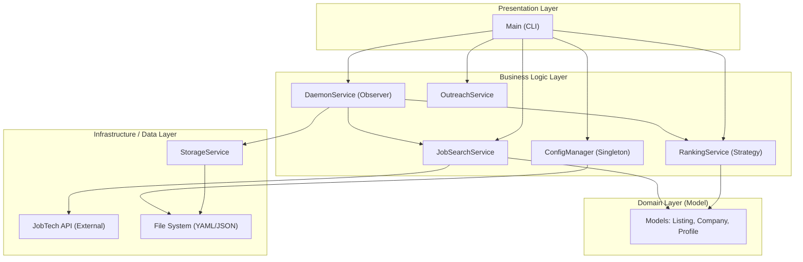
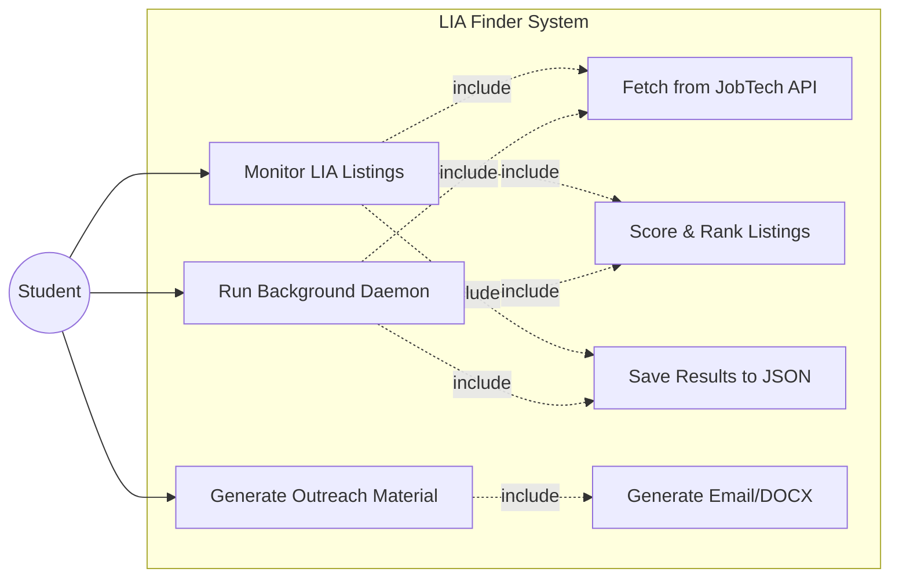

# LIA Finder Java: Architecture Diagrams

This document visualizes the structure and functional flow of the **LIA Finder AI Assistant**.

## 1. System Architecture (Layered)
We use a **Layered Architecture** to separate concerns. This ensures that the user interface (CLI) is decoupled from the business logic and data storage.

```mermaid
graph TD
    subgraph "Presentation Layer"
        CLI["Main (CLI)"]
    end

    subgraph "Business Logic Layer"
        CM["ConfigManager (Singleton)"]
        JSS["JobSearchService"]
        RS["RankingService (Strategy)"]
        DS["DaemonService (Observer)"]
        OS["OutreachService"]
    end

    subgraph "Domain Layer (Model)"
        Model["Models: Listing, Company, Profile"]
    end

    subgraph "Infrastructure / Data Layer"
        API["JobTech API (External)"]
        SS["StorageService"]
        FS["File System (YAML/JSON)"]
    end

    %% Interactions
    CLI --> CM
    CLI --> JSS
    CLI --> RS
    CLI --> DS
    CLI --> OS

    JSS --> API
    DS --> JSS
    DS --> RS
    
    RS --> Model
    JSS --> Model
    
    DS --> SS
    SS --> FS
    CM --> FS
```

## 2. Use Case Diagram (OOA)
This diagram shows how you (the User) interact with the different modes of the application.

```mermaid
graph LR
    User((Student))
    
    subgraph "LIA Finder System"
        UC1[Monitor LIA Listings]
        UC2[Generate Outreach Material]
        UC3[Run Background Daemon]
        
        UC_API[Fetch from JobTech API]
        UC_Score[Score & Rank Listings]
        UC_Save[Save Results to JSON]
        UC_Doc[Generate Email/DOCX]
    end

    User --> UC1
    User --> UC2
    User --> UC3
    
    UC1 -.->|include| UC_API
    UC1 -.->|include| UC_Score
    UC1 -.->|include| UC_Save
    
    UC2 -.->|include| UC_Doc
    
    UC3 -.->|include| UC_API
    UC3 -.->|include| UC_Score
    UC3 -.->|include| UC_Save
```

---

## 3. Class Diagram (OOD)
This diagram shows the relationship between classes and the applied **Design Patterns** (Singleton, Strategy, Observer).

```mermaid
classDiagram
    %% Core
    class Main {
        +main(args)
    }

    %% Singleton Pattern
    class ConfigManager {
        -static instance : ConfigManager
        +getInstance() ConfigManager
        +getConfig() AppConfig
    }

    %% Services
    class JobSearchService {
        +fetchListings(AppConfig)
    }

    %% Strategy Pattern Context
    class RankingService {
        -strategies : List~ScoringStrategy~
        +scoreListings(listings)
    }

    %% Strategy Interface
    class ScoringStrategy {
        <<interface>>
        +score(ScoredListing, AppConfig)
    }

    %% Observer Pattern Subject
    class DaemonService {
        -observers : List~ListingObserver~
        +start(AppConfig)
        +notifyObservers(listings)
    }

    %% Observer Interface
    class ListingObserver {
        <<interface>>
        +onListingsFound(listings)
    }

    %% Relationships
    Main --> ConfigManager : Singleton Access
    Main --> JobSearchService : Uses
    Main --> RankingService : Uses
    Main --> DaemonService : Uses
    
    RankingService o-- ScoringStrategy : Aggregates
    ScoringStrategy <|.. KeywordScoringStrategy : Implements
    ScoringStrategy <|.. DateScoringStrategy : Implements
    ScoringStrategy <|.. LocationScoringStrategy : Implements

    DaemonService o-- ListingObserver : Notifies
    ListingObserver <|.. FileStorageObserver : Implements
    ListingObserver <|.. ConsoleLoggerObserver : Implements
```

## 4. Design Patterns (VG Requirements)
Here is a breakdown of the design patterns used in this project.

### 1. Singleton Pattern (`ConfigManager`)
**What is it?** Ensures a class has only one instance and provides a global point of access to it.
- **Where:** `ConfigManager.java`
- **Why:** I only want to load the configuration file (`config.yaml`) once. By making it a Singleton, I can access the settings from anywhere in the app without passing the config object around constantly.

### 2. Strategy Pattern (`RankingService`)
**What is it?** Defines a family of algorithms, encapsulates each one, and makes them interchangeable.
- **Where:** `RankingService.java` uses `ScoringStrategy` interface.
- **Why:** Scoring a job listing is complex. Instead of one giant `if-else` block, I split the logic into strategies:
    - `KeywordScoringStrategy`: Checks for "Java", "LIA".
    - `DateScoringStrategy`: Checks for "2026", "October".
    - `LocationScoringStrategy`: Checks for "Stockholm", "Remote".
  This makes it super easy to add new rules later (e.g., a "SalaryStrategy") without breaking the existing code.

### 3. Observer Pattern (`DaemonService`)
**What is it?** Defines a subscription mechanism to notify multiple objects about any events that happen to the object they're observing.
- **Where:** `DaemonService.java` notifies `ListingObserver`s.
- **Why:** When the background daemon finds new jobs, it shouldn't care *how* we save them. It just shouts "I found jobs!" and the observers react:
    - `FileStorageObserver`: Saves them to a JSON file.
    - `ConsoleLoggerObserver`: Prints a message to the screen.
  This separates the "searching" logic from the "saving" logic.
